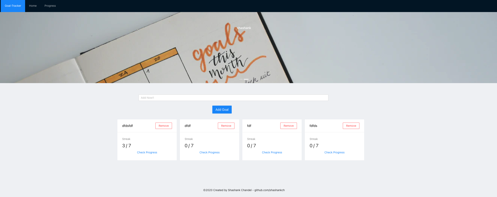
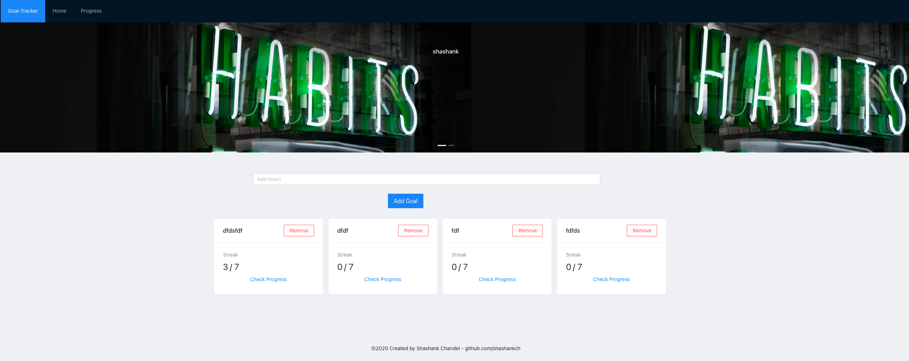
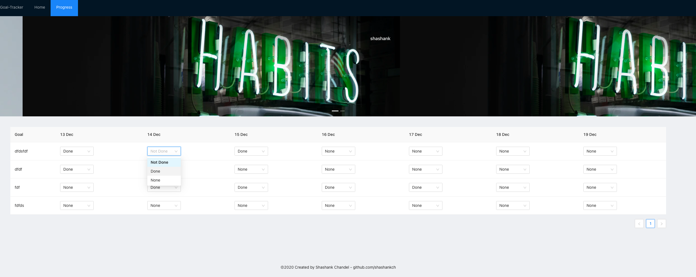

## Goals-Tracker - React Application with Ant design





#### deployed link:

#### Features:

- Add multiple habits to track like reading a book, going to the gym etc
- Track each habit everyday. These are the 3 statuses of a habit:
- Done - Mark the habit as done for a day
- Not done - Mark the habit as not done for a day
- None - User did not take any action on a habit for a day
- Displays all 7 days of each habit to track progress.
- User can toggle between the status mentioned above.

## Directory Structure:

[Link](https://goal-tracker-by-shashank.web.app/)

```
├── README.md
├── package-lock.json
├── package.json
├── public
│   ├── favicon.ico
│   ├── index.html
│   ├── logo192.png
│   ├── logo512.png
│   ├── manifest.json
│   └── robots.txt
└── src
    ├── actions
    │   ├── actionTypes.js
    │   └── goals.js
    ├── assets
    │   ├── img1.png
    │   ├── img2.png
    │   └── img3.png
    ├── component
    │   ├── App.js
    │   ├── Habit.js
    │   ├── Main.js
    │   ├── Navbar.js
    │   ├── Tracker.js
    │   └── index.js
    ├── helpers
    │   └── index.js
    ├── index.css
    ├── index.js
    ├── reducers
    │   ├── goals.js
    │   └── index.js
    └── store
        └── index.js
```

## Steps to run locally:

```
1. git clone https://github.com/shashankch/Goals-Tracker.git.

2. cd Goals-Tracker-main.

3. npm install

4. npm start


```

## Next Steps:

- add more features.

## Contributing:

- All contributions are welcome!
